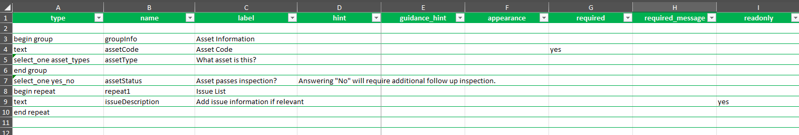
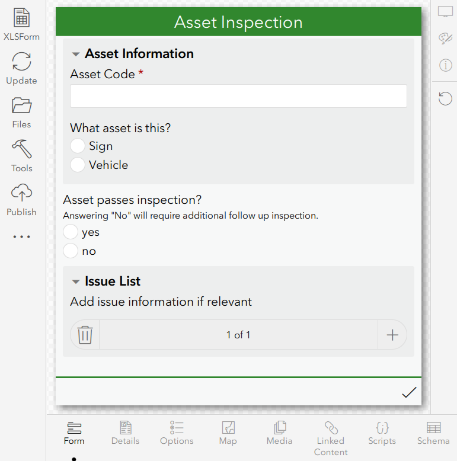

# Survey123Py

[](https://survey123py.readthedocs.io/en/latest/?badge=latest)

Survey123Py is a tool designed to simplify the creation of Survey123 forms by offering an alternative to the traditional Microsoft Excel workflow. Instead of managing complex forms in Excel with 40+ columns Survey123Py lets you define your form structure using YAML — making it easier to read, maintain, and track changes using version control systems like Git.

This package aims to enhance the developer experience by adding custom modules such as the `FormPreviewer` which allows you to verify output using samples inputs using the special field `survey123py::preview_input` in your YAML config.

If you're using the `FormPreviewer` to test outputs on the form, it is able to validate and parse almost all formulas and variables the form except for the ones specifically focused on repeaters and external data.

## Installation

Ensure you have Python 3.12 or above.

Use the package manager [pip](https://pip.pypa.io/en/stable/) to install Survey123Py.

```bash
pip install git+https://github.com/pbrotoisworo/survey123py.git
```

## Usage

Survey123Py offers three ways to work with Survey123 forms:

### 1. Generate Excel Files (Python API)
Convert YAML to Survey123-compatible Excel files:

```python
from survey123py.form import FormData

survey = FormData(version="3.22")
survey.load_survey("Survey123FormConfig.yaml")
survey.save_survey("output.xlsx")
```

### 2. Direct Publishing (Python API)
Publish surveys directly to ArcGIS Online/Enterprise:

```python
from survey123py.publisher import publish_survey

# Quick publish
survey = publish_survey(
    yaml_path="survey.yaml",
    title="Customer Survey",
    tags=["feedback", "customer"]
)
print(f"Published! URL: {survey.url}")
```

### 3. Command Line Interface

**Generate Excel only:**
```bash
python main.py generate -i survey.yaml -o output.xlsx -v 3.22
```

**Publish directly to ArcGIS:**
```bash
python main.py publish -i survey.yaml -t "My Survey" --tags demo test
```

**Update existing survey:**
```bash
python main.py update -s SURVEY_ID -i updated_survey.yaml
```

**List all surveys:**
```bash
python main.py list
```

> **Note:** Publishing functionality requires the ArcGIS Python API: `pip install arcgis`

## YAML File

Below is a sample. For a more in-depth guide please check the [YAML Construction Guide](https://survey123py.readthedocs.io/en/latest/yaml-guide.html) in the documentation.
```yaml
settings:
  form_title: Asset Inspection
  instance_name: Asset_Inspection

choices:
  - list_name: yes_no
    name: yes
    label: Yes
  - list_name: yes_no
    name: no
    label: No
  - list_name: asset_types
    name: sign
    label: Sign
  - list_name: asset_types
    name: vehicle
    label: Vehicle

survey:
  - type: group
    name: groupInfo
    label: Asset Information
    children:
      - type: text
        name: assetCode
        label: Asset Code
        required: yes
      - type: select_one asset_types
        name: assetType
        label: What asset is this?
  - type: select_one yes_no
    name: assetStatus
    label: Asset passes inspection?
    hint: Answering "No" will require additional follow up inspection.
  - type: repeat
    name: repeat1
    label: Issue List
    children:
      - type: text
        name: issueDescription
        label: Add issue information if relevant
        readonly: yes
```

This results in the following outputs in Excel and Survey123 Connect



## Contributing

Pull requests are welcome. For major changes, please open an issue first
to discuss what you would like to change.